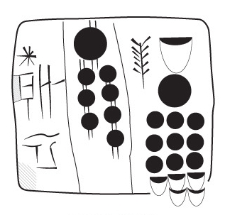
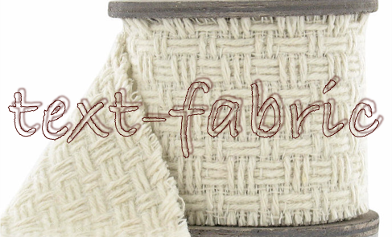

Nino-cunei
==========

Proto-cuneiform corpora in Text-Fabric
--------------------------------------

This repo is a research environment for the study of cuneiform tablets. You can
run your own programs off-line, and publish your work in online notebooks.

Corpus
------

This repo contains images and transliterations of Uruk IV-III tablets (4000-3100
BC).

The data is obtained from [CDLI](https://cdli.ucla.edu), the Cuneiform Digital
Library Initiative.

See also [about](docs/about.md) and [images](docs/images.md)

Software
--------

The main processing tool is [Text-Fabric](docs/textfabric.md). It is instrumental to
turn the analysis of ancient data into computing narratives.

The ecosystem is Python and Jupyter notebooks.

Getting started
===============

Start with the
[tutorial](http://nbviewer.jupyter.org/github/Nino-cunei/tutorials/blob/master/start.ipynb).

Authors
=======

This repo is joint work of

*   [J. Cale Johnson](https://www.universiteitleiden.nl/en/staffmembers/cale-johnson#tab-1)
    at
    [University Leiden](https://www.universiteitleiden.nl/en/humanities/institute-for-area-studies/assyriology)
*   [Dirk Roorda](https://www.linkedin.com/in/dirkroorda/) at
    [DANS](https://www.dans.knaw.nl)

Status
------

This is **work in progress!**

*   2018-03-07 More pleasant functions to call up imagery. Improvements in docs.
    Archived at Zenodo.
*   2018-03-06 Definitive data version 1.0 imported. No errors or diagnostics.
    Added over 5000 low resolution CDLI photos for tablets. Photos and linearts
    are always linked to the online data on CDLI.
*   2018-03-05 Reorganization of functionality, addition of lineart, repos have
    moved house from Dans-labs to Nino-cunei; tutorials and primers have been
    split off the data repo, which is now called `uruk`.
*   2018-02-27 More work on
    [clustering](https://github/com/Nino-cunei/tutorials/blob/master/clustering.ipynb)
    notebook.
*   2018-02-27 Work on collocation methods has started in the
    [collocation](https://github/com/Nino-cunei/tutorials/blob/master/collocation.ipynb)
    notebook.
*   2018-02-26 The tutorial is getting in shape. It is a full tour around the
    TF-API and most traits of the data in the Uruk corpus.
*   2018-02-23 The TF data has been rigorously checked. All aspects of the
    encoding into ATF can be reproduced exactly from the TF source.
*   2018-02-14 Text-Fabric data generated, but not throughly tested. A very basic
    [start](https://github/com/Nino-cunei/tutorials/blob/master/start.ipynb)
    tutorial notebook.
*   2018-02-09 Conversion coding has just started. We only parse supra-line units.
    We do not yet generate any Text-Fabric data. The sub-line parsing will be the
    most work.

