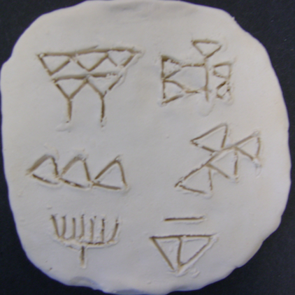

Nino-cunei
==========

[source of image](https://814eportfolios11.wikispaces.com/Kim814)

Cuneiform corpora in Text-Fabric

Sources
=======

We have taken transcriptions from [CDLI](https://cdli.ucla.edu), the Cuneiform
Digital Library Initiative.

On the [search page](https://cdli.ucla.edu/search/search.php) we entered under
*Chronology - period*: `Uruk III` and `Uruk IV` respectively. On the results
page, we have chosen `Download transliterations`. Below we list the download
links per corpus.

We have also chosen `Download all text`.
What you get then is the same transliteration, but each tablet is preceded with metadata.
We have picked the lines starting with `Excavation nr` to get the excavation numbers.
For all other purposes is it more convenient to work with the pure transcription files.

In this repo we convert the following corpora to Text-Fabric:

*   Uruk III -
    [4882 texts](https://cdli.ucla.edu/search/search_results.php?SearchMode=Text&requestFrom=Search&PrimaryPublication=&Author=&PublicationDate=&SecondaryPublication=&Collection=&AccessionNumber=&MuseumNumber=&Provenience=&ExcavationNumber=&Period=uruk+iii&DatesReferenced=&ObjectType=&ObjectRemarks=&Material=&TextSearch=&TranslationSearch=&CommentSearch=&StructureSearch=&Language=&Genre=&SubGenre=&CompositeNumber=&SealID=&ObjectID=&ATFSource=&CatalogueSource=&TranslationSource=)
*   Uruk IV -
    [1861 texts](https://cdli.ucla.edu/search/search_results.php?SearchMode=Text&requestFrom=Search&PrimaryPublication=&Author=&PublicationDate=&SecondaryPublication=&Collection=&AccessionNumber=&MuseumNumber=&Provenience=&ExcavationNumber=&Period=uruk+iv&DatesReferenced=&ObjectType=&ObjectRemarks=&Material=&TextSearch=&TranslationSearch=&CommentSearch=&StructureSearch=&Language=&Genre=&SubGenre=&CompositeNumber=&SealID=&ObjectID=&ATFSource=&CatalogueSource=&TranslationSource=)

Note that these "corpora" are merely the results of a query by period. They are
not corpora in the sense of an identified body of texts in which each individual
text occupies a fixed position in the sequence.

We have a [specification](docs/transcription.md) of the transcription format and
how we model the text in Text-Fabric.

Status
======

This is **work in progress!**

*   2018-02-27 Work on collocation methods has started in the 
    [collocation](tutorial/collocation.ipynb) notebook.
*   2018-02-26 The tutorial is getting in shape. It is a full tour around the TF-API
    and most traits of the data in the Uruk corpus.
*   2018-02-23 The TF data has been rigorously checked. All aspects of the encoding
    into ATF can be reproduced exactly from the TF source.
*   2018-02-14 Text-Fabric data generated, but not throughly tested. A very basic
    [tutorial](tutorial/start.ipynb)
    has been written.
*   2018-02-09 Conversion coding has just started. We only parse supra-line units.
    We do not yet generate any Text-Fabric data. The sub-line parsing will be the
    most work.

Getting started
==============

Start with the
[tutorial](tutorial/start.ipynb).

Authors
=======

This repo is joint work of

*   [J. Cale Johnson](https://www.universiteitleiden.nl/en/staffmembers/cale-johnson#tab-1)
    at
    [University Leiden](https://www.universiteitleiden.nl/en/humanities/institute-for-area-studies/assyriology)
*   [Dirk Roorda](https://www.linkedin.com/in/dirkroorda/) at
    [DANS](https://www.dans.knaw.nl)
