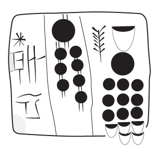

The Uruk corpus in Text-Fabric
==============================




Introduction
------------

This repo is about the digital processing of the transliterations of
proto-cuneiform tablets from the Uruk IV-III periods.

### Text-Fabric ###

[Text-Fabric](https://github.com/Dans-labs/text-fabric) is a model for textual
data with annotations that is optimized for efficient data analysis. Not only
that, it also facilitates the creation of new, derived data, which can be added
to the original data. Data combination is a feature of Text-Fabric.

Text-Fabric is being used for the [Hebrew Bible](https://github.com/ETCBC/bhsa)
and a large body of linguisitic annotations on top of it. The researchers of the
[ETCBC](http://etcbc.nl) thought that a plain database is not a satisfactory
text model, and that XML is too limited too express multiple hierarchies in a
text smoothly.

That's why they adopted a model by
[Doedens](http://books.google.nl/books?id=9ggOBRz1dO4C) that reflects more of
the essential properties of text (sequence, embedding). This model is the basis
of MQL, a working text-database system. Text-Fabric is based on the same
[model](https://github.com/Dans-labs/text-fabric/wiki/Data-model), and once the
data is in Text-Fabric, it can be exported to MQL.

See more on the effort of modeling the Hebrew Bible in Dirk's article
[The Hebrew Bible as Data: Laboratory - Sharing - Experiences](https://doi.org/10.5334/bbi.18)

With data in Text-Fabric, it becomes possible to build rich online interfaces on
the data of ancient texts. For the Hebrew Bible, we have built
[SHEBANQ](https://shebanq.ancient-data.org).

Working with TF is a bit like buying from IKEA. You get your product in bits and
pieces, and you assemble it yourself. TF decomposes any dataset into its
components, nicely stacked per component, with every component uniquely labeled.
You go to the store, make your selection, enter the warehouse, collect your
parts, and, at home, assemble your product.

In order to enjoy an IKEA product, you do not need to be a craftsman, but you do
need to be able to handle a screw driver.

In the TF world, it is the same. You do not have to be a professional
programmer, but you do need to be able to program little things. A first course
in Python is enough.

Another parallel: in IKEA you take a package with components home, and there you
assemble it. In TF it is likewise: you download the TF data, and then you write
a little program. Inside that program you can call up the Text-Fabric tool,
which act as the IKEA user manual. But your program takes control, not
Text-Fabric.

The best environment to enjoy Text-Fabric is in Python programs that you develop
in a [Jupyter Notebook](http://jupyter.readthedocs.io/en/latest/). This tutorial
is such a notebook. If you are reading it online, you see text bits and code
bits, but you cannot execute the code bits.

Chances are that a bit of reading about the underlying
[data model](https://github.com/Dans-labs/text-fabric/wiki/Data-model) helps you
to follow the exercises below, and vice versa.

Start
[here](http://nbviewer.jupyter.org/github/Nino-cunei/tutorials/blob/master/start.ipynb).

### Cuneiform tablets in ATF ###

Cuneiform tablets have been transcribed in
[ATF](http://oracc.museum.upenn.edu/doc/help/editinginatf/cdliatf/index.html)
files, in which the marks on a tablet are represented by ascii characters. The
marks on a tablet have structure (they can be composed, they build cases and
lines) and properties (they can be uncertain).


```
&P005381 = MSVO 3, 70
#version: 0.1
#atf: lang qpc
```


*Obverse* and *reverse* face of tablet
[P005381](https://cdli.ucla.edu/search/search_results.php?SearchMode=Text&ObjectID=P005381).

> Authors: Robert K. Englund and Peter Damerow
>
> Transcription by Robert K. Englund
>
> UCLA Library ARK 21198/zz001q057f

### Provenance ###

We have taken a corpus of ca. 6000 tablets, from the
[Uruk-IV/III period](http://cdli.ox.ac.uk/wiki/doku.php?id=proto-cuneiform)
(4000-3100 BC). These tablets are *proto-cuneiform*,

We have downloaded the transcriptions from the **Cuneiform Digital Library
Initiative** [CDLI](https://cdli.ucla.edu), and converted them to Text-Fabric.

We have checked the conversion from the transcriptions to Text-Fabric
extensively. Cruelly, you might say. You can follow the checks in a separate
notebook
[checks](http://nbviewer.jupyter.org/github/Nino-cunei/uruk/blob/master/programs/checks.ipynb).

### Why Text-Fabric? ###

When you search for tablet data in an ATF file, you can do so conveniently by
using regular expressions.

However, the ATF transcriptions have become packed with information. Not every
transcriber uses ATF in the same way, and there are a few coding errors in the
sources.

That means that the most obvious search expressions will leave out cases. Either
you live with that, or you refine your search expressions.

An other issue is, that when you look for something, your search expressions
must reflect the shape of not only your target, but also everything else. There
is virtually no separation of concerns.

When your search task becomes complicated, your mind tends to get overloaded
with the details of the transcription format, rather than with the quest you
would like to have in mind.

You also want to be able to divide a research task into smaller chunks. Whereas
regular expressions are a wonderful tool to look for patterns, on their own they
fall short when your search involves nested structures, intermediate sets of
patterns, special functions.
