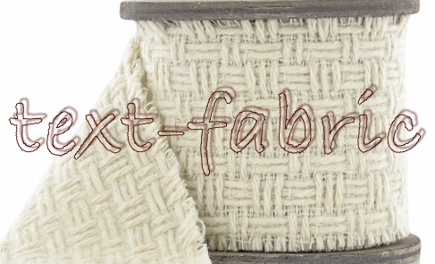

Cunei API
=========

About
-----

The module
[cunei.py](../programs/cunei.py)
contains a number of handy functions to deal with TF nodes for cuneiform tablets
and
[ATF](http://oracc.museum.upenn.edu/doc/help/editinginatf/primer/inlinetutorial/index.html)
transcriptions of them and [CDLI](https://cdli.ucla.edu) photos and lineart.

See also
[about](about.md), [images](images.md), [transcription](transcription.md) and [text-fabric](textfabric.md). 

Set up
------

In this repository, *cunei.py* resides in the *programs* directory. In order to
import it into a Jupyter notebook in a completely different directory, we have
to point Python's module path to it:

```python
import os
REPO = '~/github/Dans-labs/Nino-cunei'
PROGRAM_DIR = os.path.expanduser(f'{REPO}/programs')
sys.path.append(PROGRAM_DIR)
from cunei import Cunei
```

To use it:

    CN = Cunei(REPO)
    CN.api.makeAvailableIn(globals())

It will start Text-Fabric and load all features for you.

When `Cunei` is initializing, it scans the image directory of the repo and
reports how many photos and lineart images it sees.

Usage
-----

Now you can call the methods of *cunei*, as follows. One of the methods is
`getOuterQuads(node)`. To call it, say

```python
outerQuads = CN.getOuterQuads(line)
```

API
---

### getSource ###

Delivers the transcription source of a node. This works for the higher level
nodes that correspond to one or more source lines: tablets, faces, columns,
comments, cases (only the lowest level cases that correspond to numbered
transcription lines).

**Takes**

*   `node` the node for which the source lines should be retrieved;
*   `nodeType=None` only fetch source lines for sub-nodes of this type;
*   `lineNumbers=False` add line numbers to the result, these numbers say where
    the source line occurs in the source file;

**Returns**

*   a list of source lines (strings).

**Implementation details**

The conversion of ATF to Text-Fabric has saved the original source lines and
their line numbers in the features `srcLn` and `srcLnNum` respectively. This
function makes use of those features.

### atfFromSign ###

Reproduces the ATF representation of a sign.

**Takes**

*   `n` a node; must have node type `sign`;
*   `flags=False` whether flags will be included;

**Returns**

*   a string with the ATF representation of the sign.

### atfFromQuad ###

Reproduces the ATF representation of a quad.

**Takes**

*   `n` a node; must have node type `quad`;
*   `flags=False` whether flags will be included;
*   `outer=True` whether the quad is to be treated as an outer quad;

**Returns**

*   a string with the ATF representation of the quad.

### atfFromOuterQuad ###

Reproduces the ATF representation of an outer quad *or* sign.

If you take an ATF transcription line with linguistic material on it, and you
split it on white space, and you forget the brackets that cluster quads and
signs, then you get a seuqence of outer quads and signs.

If you need to get the ATF representation for these items, this function does
conveniently produce them. You do not have to worry yourself about the sign/quad
distinction here.

**Takes**

*   `n` a node; must have node type `quad` or `sign`;
*   `flags=False` whether flags will be included;

**Returns**

*   a string with the ATF representation of the outer quad.

### atfFromCluster ###

Reproduces the ATF representation of a cluster. Clusters are bracketings of
quads that indicate proper names, uncertainty, or supplied material. In ATF they
look like `( )a` or `[ ]` or `< >`

**Takes**

*   `n` a node; must have node type `cluster`;
*   `seen=None` set of signs that already have been done;

**Returns**

*   a string with the ATF representation of the cluster. Sub-clusters will also be
    represented. Signs belonging to multiple nested clusters will only be
    represented once.

### getOuterQuads ###

Collects the outer quads and isolated signs under a node. Outer quads and
isolated signs is what you get if you split line material by white space and
remove cluster brackets.

**Takes**

*   `n` a node; typically a tablet, face, column, line, or case. This is the
    container of the outer quads;

**Returns**

*   a list of nodes, each of which is either a sign or a quad, and, in both cases,
    not contained in a bigger quad. The order of the list is the natural order on
    nodes: first things first, and if two things start at the same time: bigger
    things first.

**Implementation details**

A quad or sign is outer, if it is not the "sub" of an other quad. We can see
that by inspecting the **sub** edges that land into a quad or sign:
`E.sub.t(node)`.

However, there might be *clusters* around the node, and such a cluster will have
an outgoing **sub** edge to the node. Hence we should test whether all incoming
**sub** edges are not originating from an other quad.

### nodeFromCase ###

Very much like the built-in
[T.nodeFromSection](https://github.com/Dans-labs/text-fabric/wiki/Api#sectioning)
of Text-Fabric. It gives you a node, if you specify a terminal case, i.e. a
transcription line.

**Takes**

*   a 3-tuple `(` *tabletNumber*, *face*:*columnNumber*, *hierarchical line
    number* `)`; the hierarchical number may contain the original `.` that they
    often have in the transcriptions, but you may also leave them out;

**Returns**

*   the corresponding node, which will be of a terminal *case*, having as
    **fullNumber** the value you supplied as *hierarchical line number*. If no
    such node exists, you get `None` back.

### caseFromNode ###

Very much like the built-in
[T.sectionFromNode](https://github.com/Dans-labs/text-fabric/wiki/Api#sectioning)
of Text-Fabric. It gives you a section tuple, if you give it the node a terminal
case, i.e. a transcription line.

**Takes**

*   the node of a terminal case (these are the cases that have a full hierarchical
    number; these cases correspond to the individual numbered lines in the
    transcription sources;

**Returns**

*   a 3-tuple `(` *tabletNumber*, *face*:*columnNumber*, *hierarchical line
    number* `)`; the hierarchical number will not contain `.`s.

### cdli ###

Delivers a link to a tablet page on CDLI, to be placed in an output cell.

**Takes**

*   a node of type `tablet` or a P-number;
*   an optional `linkText=None` with the text of the link; if None, the P-number
    of the tablet will be used.

**Returns**

*   a HTML link to CDLI, down to the page of this individual tablet.

### photo and lineart ###

Fetches photos or linearts for tablets, signs or quads, and returns it in a way
that it can be embedded in an output cell.
The images that
show up are clickable and link through to an online, higher resolution
version on CDLI. Images will
have, by default, a caption that links to the relevant page on CDLI.

**Takes**

*   one or more **nodes**; as far as they are of type
    tablet`, `quad` or `sign`, a photo or lineart will be looked up for them;
    instead of a node you mat also supply the P-number or the name of the sign or
    quad;
*   an optional **key** (a string), specifying which of the
    available images for this node you want to use; if you want to know which
    keys are available for a node, supply `key='xxx'`, or any
    non-existing key;
*   an optional `asLink=True`: no image will be placed, only a link to the online
    image at CDLI; in this case the **caption** will be suppressed, unless explicitly given;
*   an optional `withCaption='bottom'` to control whether a CDLI link to
    the tablet page must be put under the image. You can also
    specify `top` `left` `right`. If left out, no caption will be placed.
*   an optional list of key=value **options**, such as
    `width=100`, `height=200`.

The result will be returned as a *row* of images. Subsequent calls to `photo()`
and `lineart()` will result in vertically stacked rows. So you can control the
two-dimensional layout of your images.

**Implementation details**

The images will be called in by a little piece of generated HTML, using the
`` tag. This only works if the image is within reach. To the images will
be copied to a sister directory of the notebook. The name of this directory is
`cdli-imagery`. It will be created on-the-fly when needed. Copying will only be
done if needed. The names of the images will be changed, to prevent problems with 
systems that cannot handle `|` and `+` characters in file names well.

### imagery ###

Provides the sets of available images (locally).

**Takes**

*   **objectType**: the type of thing: `ideograph` or `tablet`;
*   **kind**: the kind of image: `photo` or `lineart`;

**Returns**

*   the set of available names in that category for which there is an image;
    for tablets, it lists the P-numbers; for sign/quads: the ATF representaitons.
