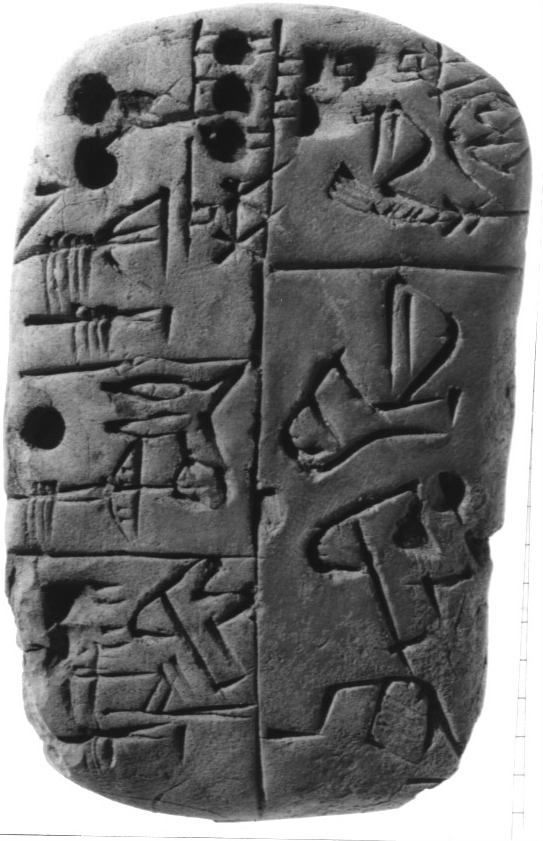
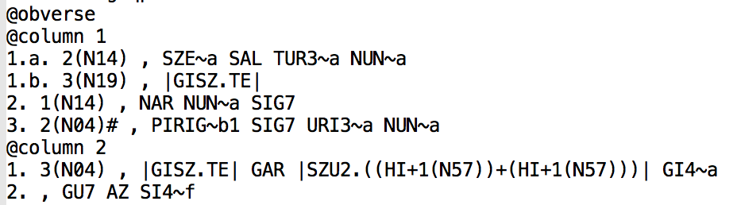
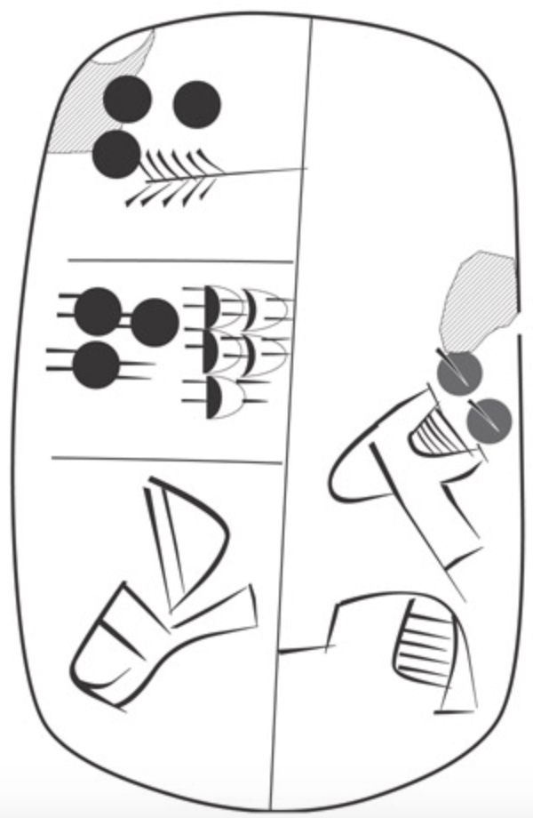

Images
======

This is an account of how we handle images we obtained from CDLI in this
repository.

See also [about](about.md).

*Obverse* and *reverse* face of tablet
[P005381](https://cdli.ucla.edu/search/search_results.php?SearchMode=Text&ObjectID=P005381).

> Authors: Robert K. Englund and Peter Damerow
>
> Transcription by Robert K. Englund
>
> UCLA Library ARK 21198/zz001q057f

Obtaining
---------

We scraped the tablet photos from CDLI, by means of code in
[imagery.py](../programs/imagery.py). Essentiall, we filled in the P-number of
all tablets in our corpus into this url:
`https://cdli.ucla.edu/dl/photo/`*P-number*`.jpg`

We downloaded the lineart files from CDLI
[Downloads page](https://cdli.ucla.edu/?q=downloads), and processed them for
optimal usage in GitHub repositories and Jupyter notebooks.

Here are the links we used:

*   lineart for tablets:
    [Postscript files, cdli texts](https://cdli.ucla.edu/tools/cdlifiles/cdli_epstextcopies.zip)
*   lineart for ideographs and numerals:
    [Proto-cuneiform signs: 300ppi jpg](https://cdli.ucla.edu/tools/cdlifiles/signlists/archsignfiles_jpg.zip)

Processing
----------

The tablet photos came as JPG files in reasonable quality and size: ca 400KB per
tablet. We have donwsized all photos by decreasing the JPEG quality to 30%, by
means of [ImageMagick](https://www.imagemagick.org/script/index.php):

    magick original.jpg -quality 30% lowres.jpg

The tablet lineart came as EPS files. We transformed them with Imagemagick to
JPG.

This was the command:

    magick -density 300x300 image.eps -quality 50% image.pdf

For the ideographs and numerals we used the jpg versions on CDLI. But we needed
to crop them, because especially the numerals were little drawings on a page
size canvas. We cropped automatically by means of ImageMagick:

    magick original.jpg -trim +repage cropped.jpg

Management
----------

We have:

objectType | kind | amount | size
---------- | ---- | ------ | ----
ideograph | lineart | 2000 | 60 MB
tablet | lineart | 2700 | 250 MB
tablet | photo | 5500 | 475 MB

This fits well into a GitHub repository.

In this repo, they are all in subdirectories of
[images](../sources/cdli/images).

Issues
------

Working with images in notebooks is subject to a few issues. Especially when
notebooks are reside in repositories such as GitHub and are published online.
Images in notebooks are external files referenced by them. It is one thing to
get the references working locally on your machine, but it is a quite different
matter to not break those references when everything sits in a repo and is
viewed as a website.

### Images must be near to notebooks ###

When a notebook refers to an image file in one of its markdown cells, the image
file must be within reach, i.e. in the directory tree with the notebook
directory at the top.

A notebook can also display an image as output of a code cell. In that case,
Python can find the image from everywhere.

We want a consistent availability of images, hence we have chosen for the
following tactic.

Whenever we call up an image from a notebook by means of the [Cunei](cunei.md)
functions the image will be copied to a directory `cdli-imagery` next to the
notebook, and from there the image will be included.

### PDF images ###

Images of type *pdf* do not behave well when the notebook is shown on GitHub.
They do show well when the notebook is rendered from GitHub by the website
[NBViewer](http://nbviewer.jupyter.org/github/Nino-cunei/). But NBViewer has
other problems with images.

The ultimate problem with PDFs is that browsers do not consider PDF to be an
image type like JPG, GIF, PNG. It is a pity, because the CDLI EPS images
translate to beautiful, small PDFs with infinite resolution.

At the end of the day, this left us with one viable strategy: convert all EPS
upfront to JPG.

The alternative, to do the copying on-the-fly, from within the notebook, is less
attractive, because the users must have Imagemagick installed. That is an extra
hurdle for users.

### File names ###

The filenames of composite sign images contain `+` and `|` characters. A good
example is `|(HIx1(N57))&(HI+1(N57))|.jpg`

Names like these wreak havoc with urls for browsers, because certain characters
must be escaped, and some intermediate systems fail to recognize the proper file
names out of the escaped urls. At the moment there is no escape strategy that
works for GitHub and NBViewer.

Here our tactic is supplemental to the tactic above of moving images close to
the notebook: in doing so we change their names. So the local copies of the
images have names that are easy on all systems that need to handle them.
